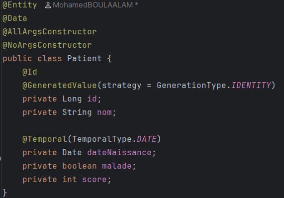
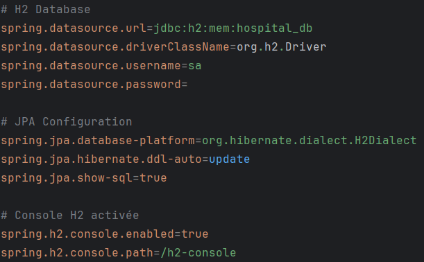
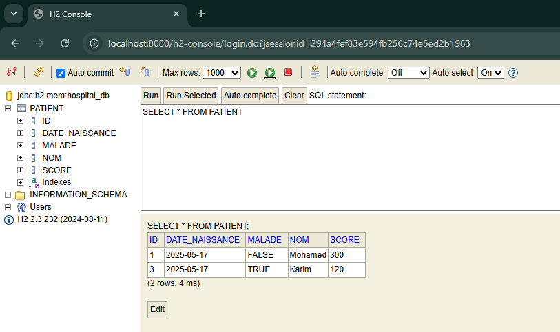
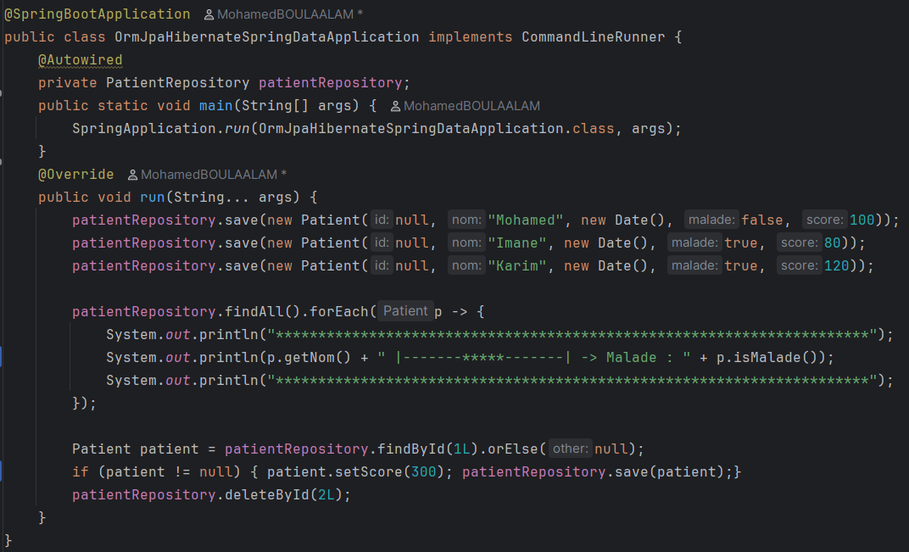
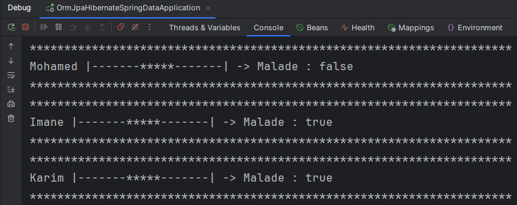

# 🏥 AP2 - ORM JPA Hibernate Spring Data

> Activité Pratique N°2 – Gestion des Patients avec Spring Boot, JPA, Hibernate et H2 Database

---

## 📌 Objectif du projet

Créer une application Java Spring Boot permettant de gérer les patients dans un système médical simple, en utilisant les outils suivants :

- Spring Data JPA pour le mapping objet-relationnel
- Hibernate comme moteur ORM
- H2 comme base de données en mémoire
- Lombok pour simplifier le code Java

---

## 🛠️ Technologies utilisées

- Java 17
- Spring Boot 3.4.4
- Spring Data JPA
- Hibernate ORM
- H2 Database
- Lombok
- IntelliJ IDEA Ultimate

---

## ✅ Étapes réalisées

### 🧱 1. Entité JPA : `Patient`

Nous avons créé une classe `Patient` annotée avec `@Entity` représentant un patient avec les attributs suivants :

- `id : Long`
- `nom : String`
- `dateNaissance : Date`
- `malade : boolean`
- `score : int`

*Capture de l’entité `Patient.java` :*

---

### 🛠️ 2. Configuration de la base de données H2

La configuration a été placée dans le fichier `application.properties`, avec activation de la console H2.

*Configuration H2 :*

---

### 📂 3. Création de `PatientRepository`

Interface basée sur `JpaRepository<Patient, Long>` qui permet d’effectuer toutes les opérations CRUD, ainsi que des méthodes personnalisées comme :

- `findByMalade(boolean malade)`
- `findByNomContains(String keyword)`

*Capture de `PatientRepository.java` :*

---

### 🚀 4. Classe principale : insertion et affichage

Nous avons utilisé `CommandLineRunner` pour insérer des patients, les afficher, les modifier et en supprimer un.

*Extrait du code d’exécution dans `OrmJpaHibernateSpringDataApplication.java` :*

---

### ✅ 5. Résultats de l’exécution

- Insertion des patients : Mohamed, Imane, Karim
- Affichage en console
- Modification du score du patient n°1
- Suppression du patient n°2

*Résultat d’exécution dans la console :*

---

## 🧪 Résultat fonctionnel

L’application démarre sans erreurs, les entités sont bien mappées, la base de données est initialisée automatiquement, et les opérations sur les patients s’exécutent correctement.

---

## 🧑‍💻 Auteur

- **Nom :** Mohamed BOULAALAM 
- **École :** ENSET Mohammedia
- **Filière :** Ingénierie Informatique – Big Data & Cloud Computing

